# Smart Online Marketplace Bot powered by LangGraph.js & MongoDB vector DB & similarity search


## 🎯 Project Overview

This project showcases an advanced **AI assistant** built with an **agentic framework**. It’s more than just a typical chatbot — it’s a proactive system designed to:

- **Analyze** customer inquiries deeply and select the best course of action
- **Execute** precise product searches via vector embeddings in databases  
- **Adapt** seamlessly by switching to backup search methods if needed
- **Remember** previous conversations to maintain context and continuity

***

## 📚 Learning Outcomes

<table>
<tr>
<td width="50%">

### 🏗️ **Fundamental Concepts**
-  **Agentic AI design principles**
- **MongoDB Atlas vector search utilization**
- **Workflow orchestration using LangGraph**
- **Managing conversational state effectively**

</td>
<td width="50%">

### 🛠️ **Hands-on Skills**
- **Integrating APIs** (OpenAI & Gemini)
- **Developing Frontend with Next.js**
- **Designing RESTful APIs**
- **Seeding and managing MongoDB databases**

</td>
</tr>
</table>

***

## 🚀 Getting Started

Ensure you have the following before proceeding:

<table>
<tr>
<td>

**Essential Software**
- [Latest Node.js & npm (v18+)](https://nodejs.org/)
- Git version control

</td>
<td>

**Required API Keys**
- [Google AI API Key](https://aistudio.google.com/app/apikey)
- [Account on MongoDB Atlas](https://www.mongodb.com/cloud/atlas)

</td>
</tr>
</table>

***

## ⚡ Quick Setup Guide

### **Step 1: Clone the Repository & Install**

```bash
# Clone this project
git clone https://github.com/Sourav01112/online-marketplace-bot
cd online-marketplace-bot

# Install dependencies for the server
cd server
npm install
```

### **Step 2: Configure Environment Variables**

Inside the `server` folder, create a `.env` file with these variables:

```env
# AI API credentials
GOOGLE_API_KEY=your_google_api_key_here

# MongoDB connection URI
MONGODB_URI=your_mongodb_atlas_uri_here
```

### **Step 3: Populate the Database**

```bash
# Use AI to generate synthetic data for furniture products
npm run seed
```

<details>
<summary>🔍 What happens during the seeding process?</summary>

- 🤖 Generates 10 highly realistic furniture product entries  
- 📝 Creates detailed summaries for each product for searching  
- 🔢 Computes vector embeddings via OpenAI API  
- 💾 Saves all data into MongoDB Atlas for quick access  

</details>

### **Step 4: Launch the Server**

```bash
npm run dev
```

The backend API will be accessible at `http://localhost:8000` 

***

## 🧪 How to Test Your AI Assistant

### 💬 **Initiate a Conversation**
```bash
curl -X POST -H "Content-Type: application/json" \
  -d '{"message": "Do you have Steel Rebar in your store?"}' \
  http://localhost:8000/chat

```

**Sample Response:**
```json
{
  "threadId": "thread_1755954113254_ehx4pqkir",
  "response": "Yes, we have PVC pipes in stock. ..."
}

```

### 🔄 **Continue the Chat Session**
```bash
curl -X POST -H "Content-Type: application/json" \
  -d '{"message": "Ok, I need 5 meters of that."}' \
  http://localhost:8000/chat/thread_1755954113254_ehx4pqkir

```

```bash
curl -X POST -H "Content-Type: application/json" \
  -d '{"message": "How to order Ashirvad Pipes, 6 metres, PVC, 20 mm ?"}' \
  http://localhost:8000/chat/thread_1755954113254_ehx4pqkir

```

```bash
curl -X POST -H "Content-Type: application/json" \
  -d '{"message": "2 inch Ashirvad Pipes, 6 metres, CPVC is fine."}' \
  http://localhost:8000/chat/thread_1755954113254_ehx4pqkir

```

```bash
curl -X POST -H "Content-Type: application/json" \
  -d '{"message": "Please send me a quote with delivery to Sector 62, Noida."}' \
  http://localhost:8000/chat/thread_1755954113254_ehx4pqkir

```

***

## Frontend Configuration

### **Step 5: Start the Next.js Interface**

```bash
cd ../client
npm install

npm run dev
```

Then, open your browser to `http://localhost:3000` and experience your AI-driven e-commerce platform! ✨

***

## 🏗️ System Architecture

```mermaid
graph TD
    Start([Start]) --> UserInput[👤 User Input]
    UserInput --> LangGraphAgent[🤖 LangGraph Agent]
    LangGraphAgent --> DecisionEngine[🧭 Decision Engine]
    DecisionEngine --> ToolSelect{🔧 Select Tool}

    ToolSelect -->|Search| VectorSearch[🧠 Vector Search]
    ToolSelect -->|Fallback| TextSearch[📄 Text Search]
    ToolSelect -->|Direct| GenerateResponse[💬 Generate Response]

    VectorSearch --> MongoDB[(🗄️ MongoDB Atlas)]
    TextSearch --> MongoDB
    MongoDB --> Results[📋 Processed Results]
    Results --> GenerateResponse
    GenerateResponse --> FinalReply[✅ Final Reply to User]
    FinalReply --> End([End])

```

<div align="center">



</div>

***

## Highlights & Features

<table>
<tr>
<td width="33%">

### **Smart Decision Engine**
- Automatically selects tools for each query  
- Responses depend on conversation context  
- Supports multi-step reasoning and planning  

</td>
<td width="33%">

### **Sophisticated Search**
- Uses vector-based semantic search for accuracy  
- Falls back to text-based search if necessary  
- Provides real-time product availability  

</td>
<td width="33%">

### **Engaging Conversations**
- Conversation history is remembered  
- Thread-based chat persistence  
- Human-like interaction patterns  

</td>
</tr>
</table>

***

## 🛠️ API Reference

| HTTP Method | Endpoint         | Description              | Example Response               |
|-------------|------------------|--------------------------|------------------------------- |
| `GET`       | `/`              | Server health check      | Status and uptime information  |
| `POST`      | `/chat`          | Begin new chat session   | Returns thread ID and answer   |
| `POST`      | `/chat/:threadId`| Continue existing session| Returns contextual reply       |

***

## Why "Agentic"?

Our AI assistant differs from traditional chatbots because:

| 🤖 Conventional Chatbots       | 🧠 This Agentic AI Assistant              |
|--------------------------------|-------------------------------------------|
| Respond with scripted answers  | Make dynamic decisions autonomously       |
| Provide static info only       | Query live databases in real time         |
| Limited to single-turn replies | Handle multi-step, evolving dialogs       |
| No external tool integration   | Utilize tailored tools seamlessly         |
| Fail to recover from errors    | Implement intelligent fallback strategies |

***

## Contributing & Feedback

Contributions and suggestions are warmly welcomed! Feel free to open issues or submit pull requests.

***


